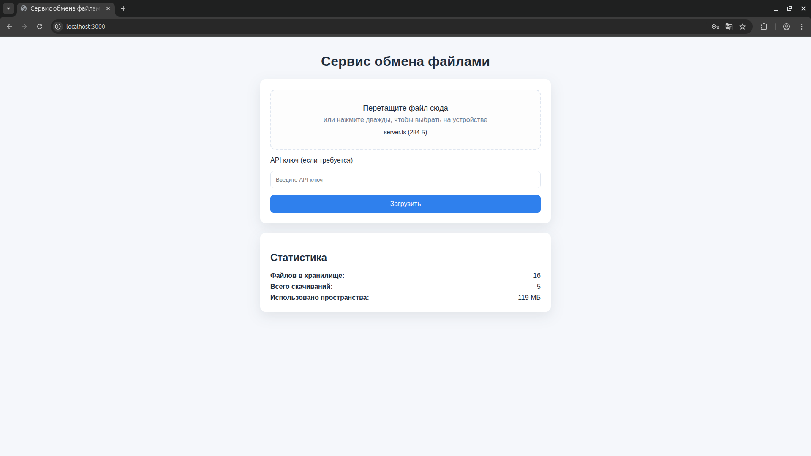
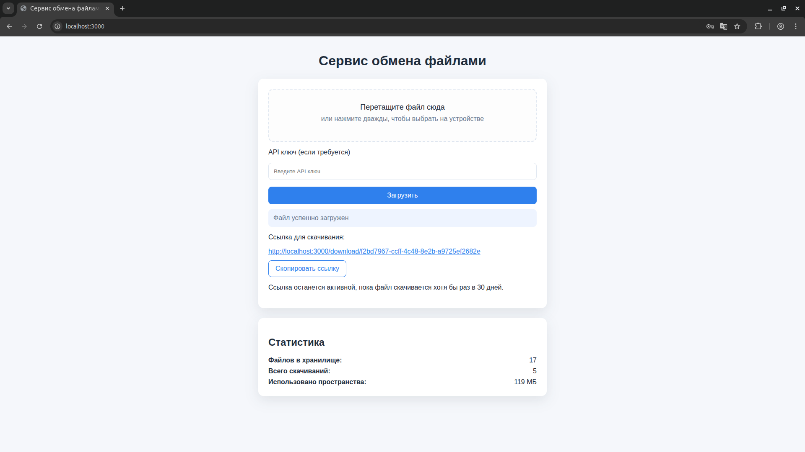

# File Sharing Service

Одностраничный сервис для обмена файлами с drag-and-drop интерфейсом, авторизацией через API ключ и очисткой просроченных загрузок. Сервер написан на TypeScript/Express, фронтенд — JavaScript.

## Возможности
- Загрузка через форму или перетаскивание файла; автоматическое отображение выбранного файла и прогресса.
- Генерация ссылок для скачивания с ограниченным сроком жизни и счётчиком загрузок.
- Опциональный API ключ (`x-api-key`) для защиты загрузок.
- Кнопка копирования ссылки в буфер обмена и просмотр статистики (хранилище, скачивания, объём).
- Фоновая очистка файлов, не скачиваемых в течение заданного числа дней.

## Требования
- Node.js 20+ (используется `ts-node-dev`, top-level `await` и современные Web API).
- npm 9+.

## Быстрый старт
```bash
cd backend
npm install
```

### Настройка окружения
Создайте файл `.env` в каталоге `backend` (рядом с `package.json`) и укажите нужные параметры:

```dotenv
PORT=3000              # опционально; по умолчанию 3000
HOST_URL=https://host  # опционально; используется при генерации ссылок
API_KEY=secret         # опционально; если не задан, загрузка открыта
RETENTION_DAYS=30      # срок хранения без скачиваний, по умолчанию 30
```

При первом запуске сервер автоматически создаст каталоги `uploads/` и `data/files.json` для файлов и метаданных.

### Режим разработки
```bash
npm run dev
```
Сервер запустится на `http://localhost:3000`. Статика доступна по `/`, API — под префиксом `/api`.

### Сборка и запуск в продакшене
```bash
npm run build
npm start
```
Первое создаёт `dist/`, второе запускает собранный JavaScript (`dist/server.js`).

## Структура каталога
```
backend/
├── public/                # фронтенд (HTML, CSS, ES-модули)
├── src/
│   ├── config.ts          # чтение .env и базовые настройки
│   ├── routes/            # REST API
│   ├── services/          # фоновые задачи (очистка)
│   └── storage/           # долговременное хранение метаданных
├── uploads/               # загруженные файлы (создаётся автоматически)
└── data/files.json        # список файлов (создаётся автоматически)
```

## API
- `POST /api/files` — загрузка файла (поле `file` в `multipart/form-data`). Возвращает `downloadUrl`, `token`, `expiresInDays`.
- `GET /api/files/:token/meta` — метаданные файла; 404 если не найден.
- `GET /api/stats` — агрегированная статистика (количество файлов, скачиваний, объём, политика хранения).
- `GET /download/:token` — скачивание файла по сгенерированной ссылке.

При активном `API_KEY` каждую загрузку нужно сопровождать заголовком `x-api-key`.

## Очистка и хранение
- Очистка запускается раз в час (`cleanupIntervalMs`), удаляя файлы, не скачанные в течение `RETENTION_DAYS`.
- Удаление файла синхронизируется с метаданными (`data/files.json`), чтобы статистика не расходилась с фактическими данными.

## Фронтенд
- Статические файлы лежат в `backend/public/`.
- Главный модуль — `public/js/main.js`, остальные разбиты по функциональным блокам (`dragAndDrop`, `upload`, `stats`, т.д.).
- Для копирования ссылок используется `navigator.clipboard` с fallback на `document.execCommand`.

## Скриншоты




